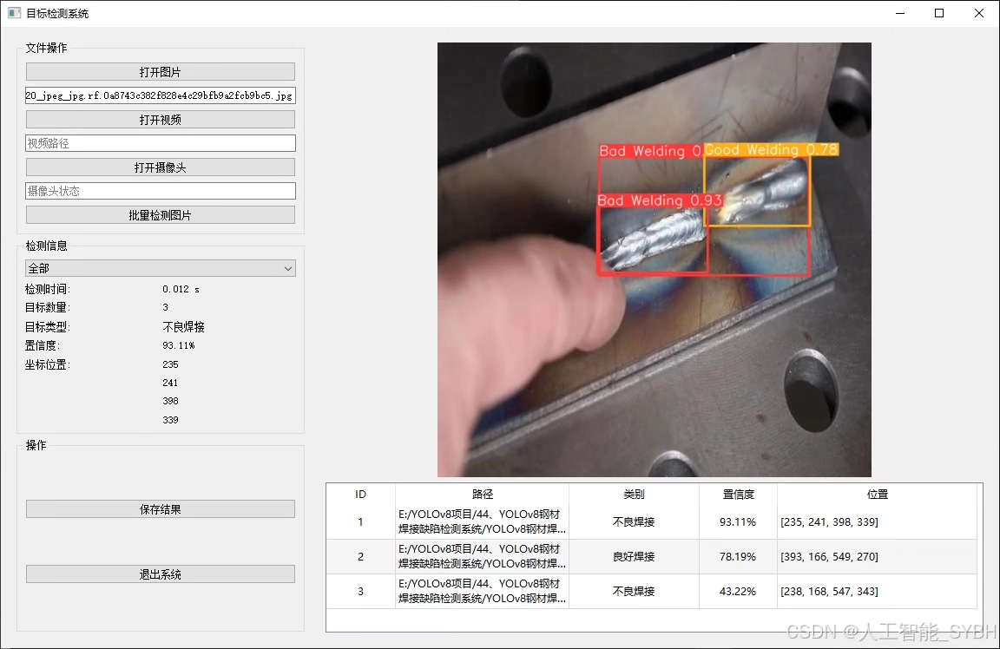
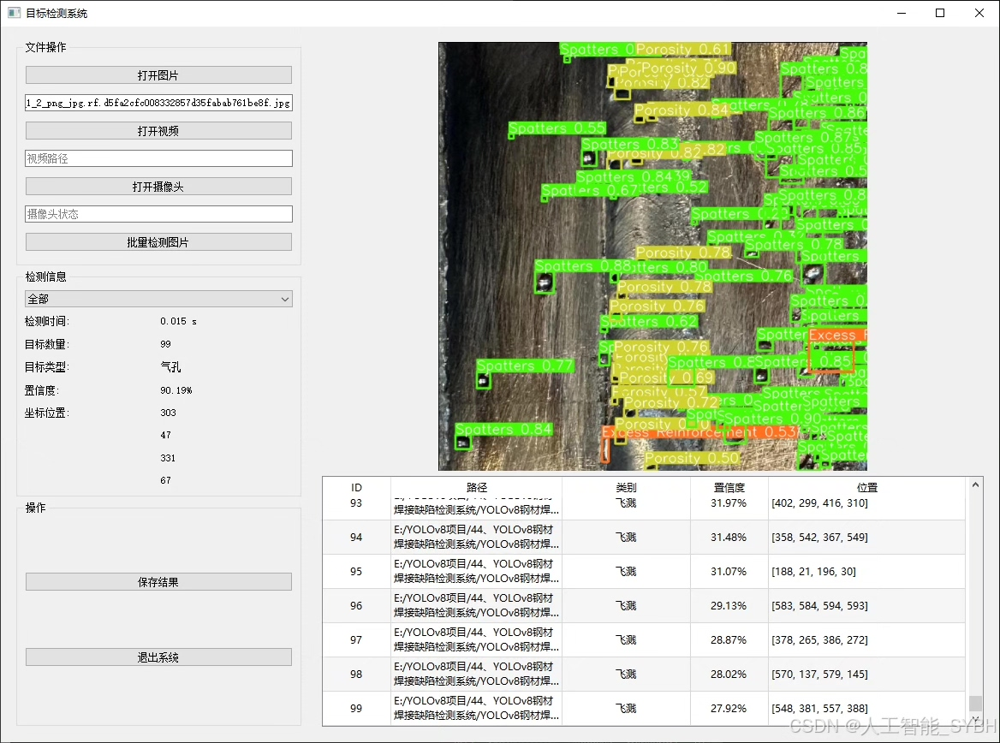
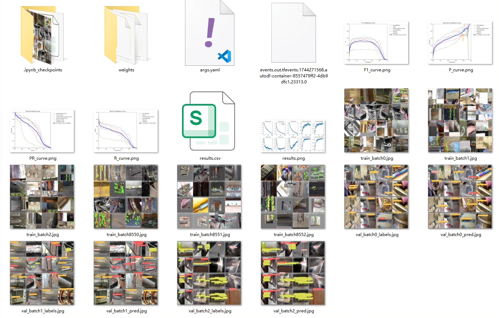
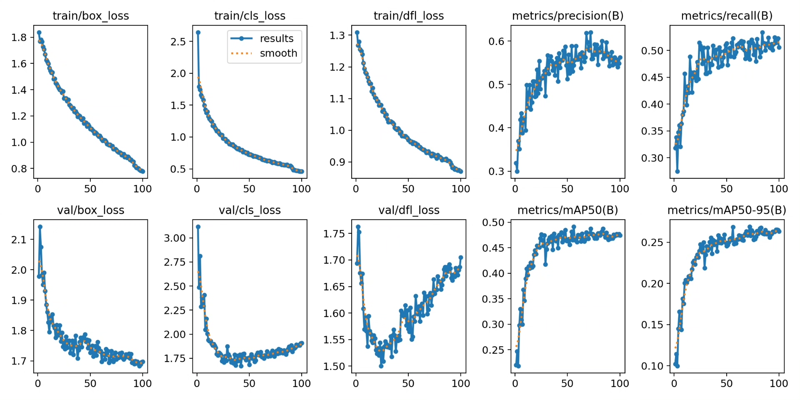
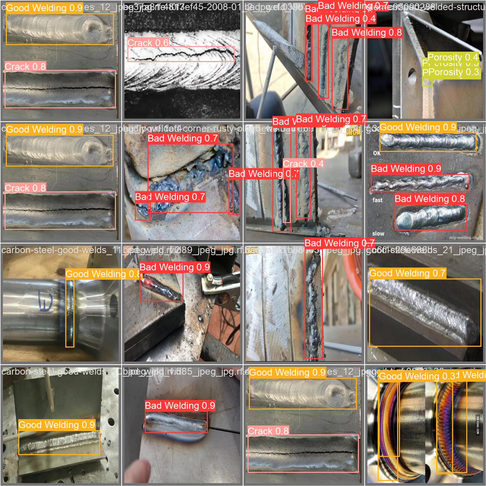
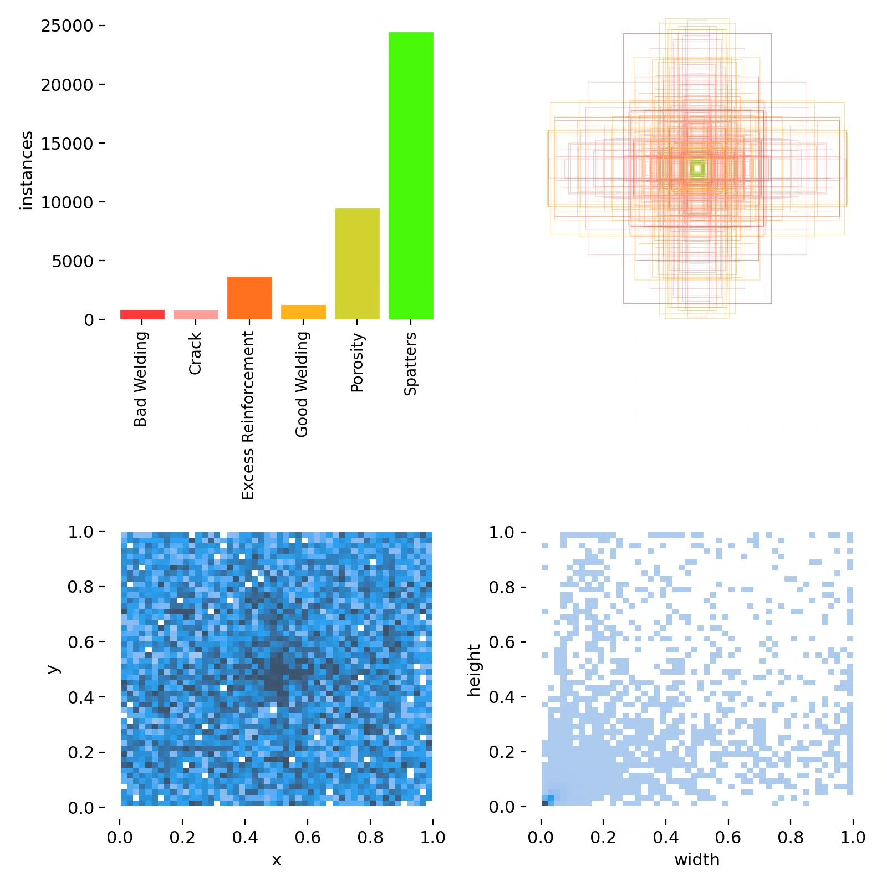
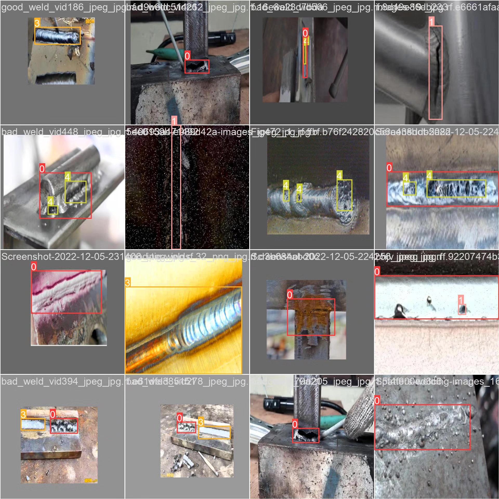

# Steel Welding Defect Detection System Based on YOLOv8 Deep Learning

## Body

Based on the YOLOv8 deep learning framework, this project has developed a steel welding defect detection system that can automatically identify and classify six common welding quality conditions, including good welding and five typical defects. The system uses a dedicated dataset containing 3,037 training images, 422 validation images, and 205 test images for training and evaluation. It achieves precise recognition of 'Bad Welding', 'Crack', 'Excess Reinforcement', 'Good Welding', 'Porosity', and 'Spatters' among six types of welding states. Through computer vision technology, the system replaces traditional manual detection methods, significantly improving the efficiency and accuracy of welding quality inspection. It provides an intelligent solution for quality control in the manufacturing industry.

The company's products have obtained YOLO official commercial license certification.

We offer after-sales service.

After payment, we will provide a WeChat account to answer questions anytime.

Environmental configuration: We will provide a tutorial on environmental configuration, and WeChat will provide answers.

Remote installation service: If you need remote configuration, an additional fee of 69 is required, with all fees refunded if the configuration fails (only refund installation fees for older computers).

Retraining dataset: After setting up the environment, you can train on your own computer. If you need us to retrain, just pay 69 plus computing power fees (2.5 yuan/hour).

Full after-sales service

## Images

## Payment

Here is a pay link on Stripe ( https://buy.stripe.com/3cs8yP7sY87d0vu9AB ). Please contact me lonlonago@foxmail.com after funding $89, and I will send you a complete data files , thank you!

